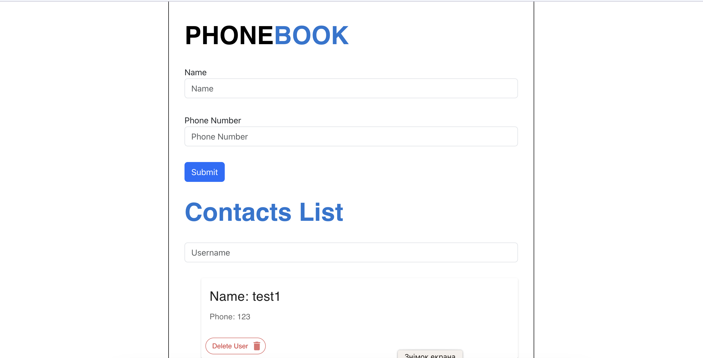
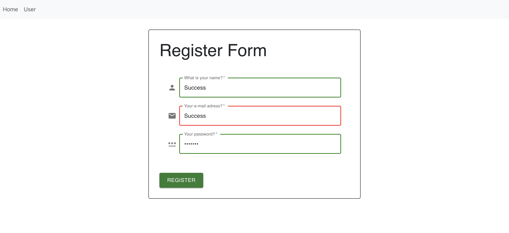
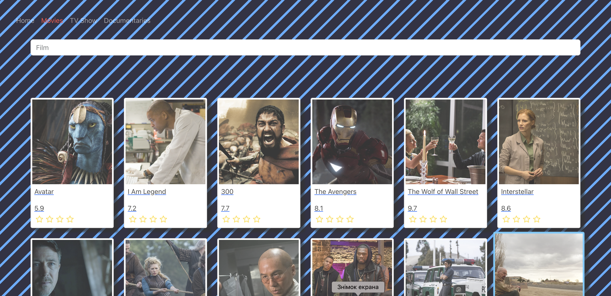
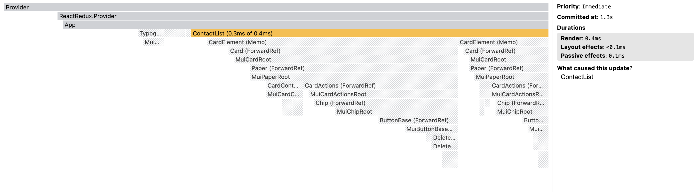

# Phone book (Redux - RTK Query)

# createSelector, createEntityAdapter (react_redux_tollkit)

Refactor the Phone Book application code. Delete the code responsible for
storing and reading contacts from local storage and add work with backend to
store contacts.

Create a development backend with a UI service [mockapi.io](https://mockapi.io).
or JSON - Server

Create a `contacts` resource to get the `/contacts` endpoint. Use resource
constructor and describe the contact object as in the illustration.

use the function
[createAsyncThunk](https://redux-toolkit.js.org/api/createAsyncThunk) or
[RTK Query](https://redux-toolkit.js.org/rtk-query/overview) for interaction
with backend and asynchronous requests.

   
